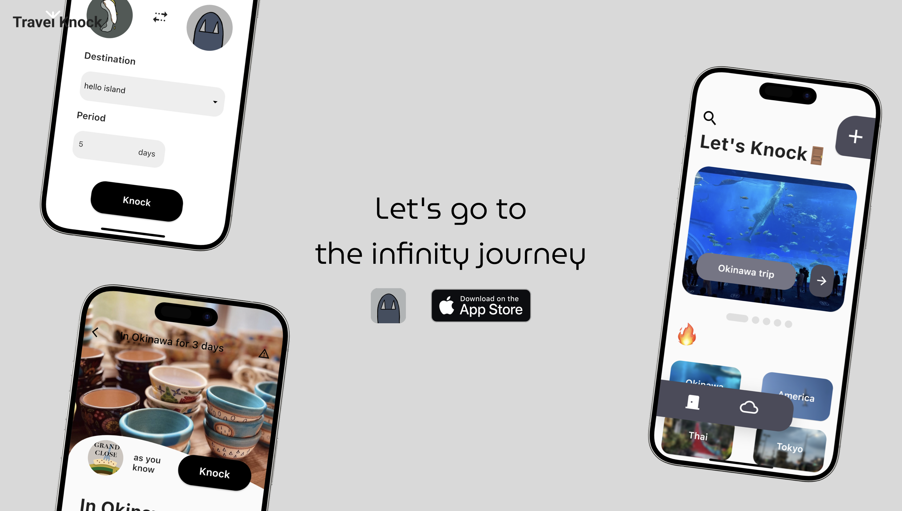
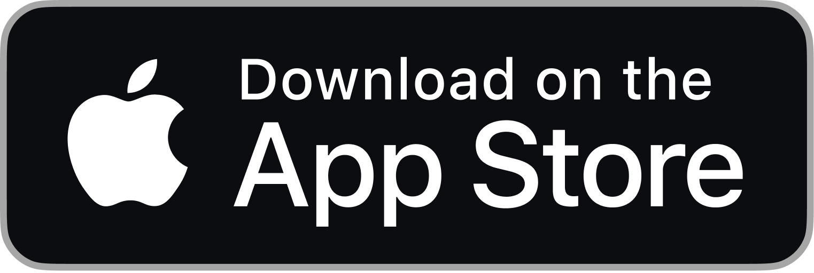
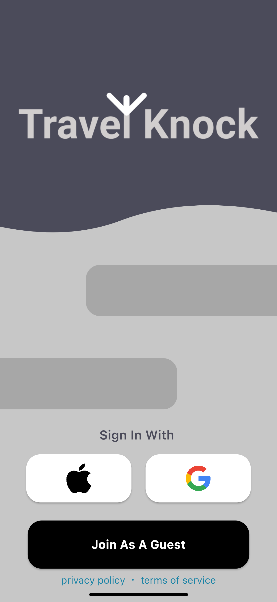
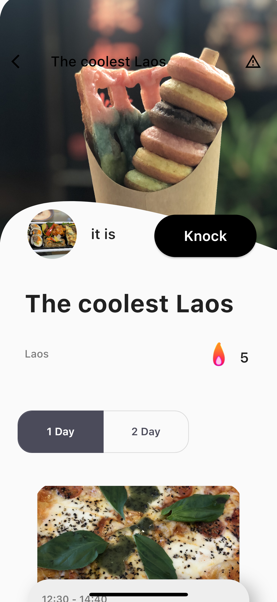
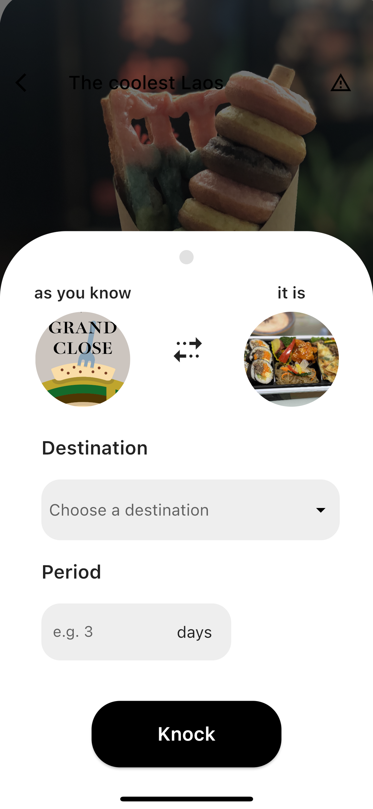
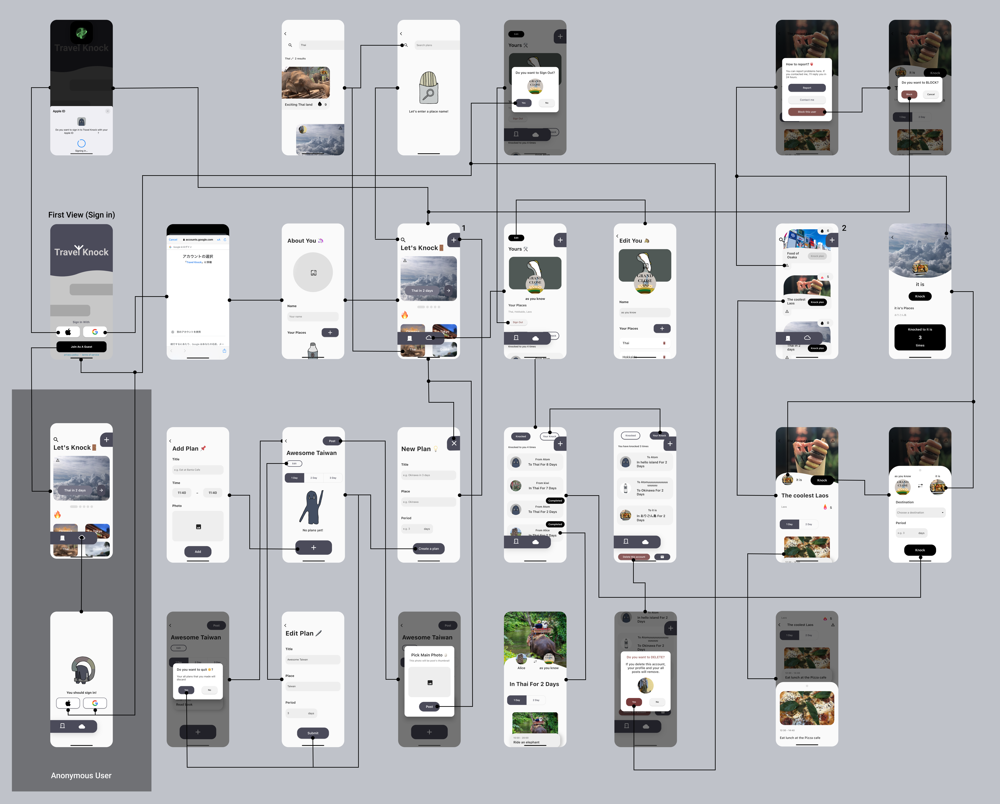

 
<!-- Logo -->

  
<!-- Download buttons -->

<!-- Badges -->
  

  

## 🚪 What's Travel Knock?

Let's go to the infinity journey. 
Travel Knock is a SNS application of traveling around the world that you've never been. 
It has post features but also you can request plans to other users.

<!-- Folding Japanese of What's -->

Japanese

 
出かけよう、無限大の旅へ。 
Travel Knock は今までにない自分だけの旅行ができる SNS です。 
旅行のプランの投稿機能はもちろんのこと他のユーザーにプランの作成をリクエストすることもできます。

  

## 🥑 Why?

I'm from Okinawa.  
Recently I see a lot of tourists in Okinawa.  
I thought they always go to the same place. 
Why they won't travel other places, even Okinawa has more beautiful place, nature and sea. 
So I made up my mind to develop this app to introduce my recommended spots and restaurants in Okinawa.

<!-- Folding Japanese of Why -->

Japanese

 
私は沖縄出身です。 
そして沖縄に来る観光客の方達をよく見かけるのですが、その人たちはほぼ同じ場所にしか行かないということに気がつきました。 
沖縄にはまだたくさんの綺麗な場所と海と自然があるのになぜ一箇所に集中して他のところへ行かないのだろうと思いました。 
そこで、沖縄での私のお気に入りのスポットやレストランを紹介したいと思い、このアプリを開発しました。

 

## 📜 Details

- 🗓️ Production Period: 2023 2nd of October - 2023 28th of December **(87 days)**
- 🥞 Who Made it: [aoiorio](https://github.com/aoiorio)
- 👀 Persona: [See Google Slide](https://docs.google.com/presentation/d/1YYfqCNl7ALHgNOgeP_mIqig88LjKXmcXP1rr94V81ZY/edit#slide=id.g2ad363fd857_0_9)
- 🎨 Design On: [Figma](https://www.figma.com/file/4WWWgaAZlPMIckCC6kyll7/Travel-Knock?type=design&node-id=0%3A1&mode=design&t=0H9AugB3PNMOdZ8q-1)
- 🪼 Flow: [See Google Slide](https://docs.google.com/presentation/d/1YYfqCNl7ALHgNOgeP_mIqig88LjKXmcXP1rr94V81ZY/edit#slide=id.g2ad363fd857_0_278)
  

## 🪿 Features

 

- 📮 Post
    *   Post your traveling plans to other users.
    *   Create title, period and place that you went. And archive travel experiences using images and texts in different days.
    *   Plan the places you want to go.
    *   This is useful to journal your travel plans.
    *   Introduce your recommendations and your secret spots.
    *   Select awesome thumbnail images of plans.

- 🌵 Plan
    *   Always get the latest information of traveling.
    *   Maximize your experience when on sightseeing and discover new spots.
    *   Search place name, and you'll get what you wanted.
    *   See your favorite users' posts.
    *   Broaden your journey with easy to understand images and title.

- 🤓 Knock
    *   Request a plan to other users who are locals with one tap.
    *   If it's your first time traveling in one place, you can knock first.
    *   Users can choose places and period set in advance.
    *   Knock users can accept and create plans to requested users.
    *   See "knocked to you" at Profile Page for requested plans of users.
    *   See "your knock" at Profile Page for my requests.
    *   Confirm requests anytime and anywhere.
    *   Plans are private for both users.
    *   Share spots, restaurants, etc...

- 🔥 Fire
    *   "Fire" to other users' posts.
    *   Change the color of fire.
    *   Posts with the greatest number of "Fire" are displayed first on screen.

- ⛄️ Profile
    *   Create your original avatar, header, username and places.
    *   If you tap the users' icon, you'll see number of "knocked", number of "your knock".
    *   View posts that only specific user.
    *   Report users.

- ☄️ Hot Places
    *   Display places that have a lot of fires and posts now.
    *   View the posts of the place with tap the image.

- 🫔 Sign in
    *   Sign in so easily.
    *   Without sign in you can see and search plans.

<!-- Folding Japanese of Features -->

Japanese

 

- 📮 Post

    - あなたの旅行したプランを他のユーザーに投稿

    - タイトル、期間、行った場所を決めることができ、日にち別に旅の詳細を画像と文字で記録

    - 自分がやりたい旅行などのプランニングにも活用

    - 自分の行きたい場所のプランのメモとしても有効

    - 自分の住む地域のおすすめの場所や穴場のスポットを紹介

    - 素敵なサムネイルを選択してアピール

- 🌵 Plan

    - 常に新しい旅行の情報を入手

    - 観光をするだけでは出会えなかったスポットを発見

    - 場所の名前を検索してあなたの行きたかった場所へ一直線

    - お気に入りのユーザーが投稿したプランを閲覧

    - 画像とわかりやすいタイトルであなたの旅がもっと広がる

- 🤓 Knock

    - ワンタップであなたが気に入ったユーザーにプランの作成をリクエスト

    - 旅行が初めての人でも”Knock”をしたらもう大丈夫

    - ユーザーがあらかじめ設定した地域と行きたい旅行の期間を選択

    - あとは待つだけで旅行のプランが完成

    - プロフィールページからあなたに届いた”Knock”を表示

    - あなたが”Knock”した内容を閲覧

    - リクエストしたユーザーの詳細を簡単に確認

    - 他のユーザーにプランを作成

    - 出来上がったプランは2人だけのシークレット

    - 思う存分あなたの伝えたいスポットやレストランなどを共有

- 🔥 Fire

    - 他のユーザーの投稿にfireをつける

    - fireをすると炎の色が変化

    - fireが多い投稿は一番上に表示

- ⛄️ Profile

    - あなたオリジナルのヘッダーやアイコン、ユーザーネーム、地域を設定

    - ユーザーのアイコンをタップするとKnockされた回数やKnockした回数などが表示

    - そのユーザーが投稿したプランだけを閲覧

    - 通報機能も搭載

- ☄️ Hot Places

    - 今最も投稿されていて、fireが多い地域を表示

    - 画像をタップでその地域で投稿されているプランを確認

- 🫔 Sign in

    - GoogleとAppleで手軽にサインイン
    - サインインなしでも、投稿を閲覧・検索
  

  

## 🦭 Ranking Of Passion
- **🥉 [Animation Fire](https://docs.google.com/presentation/d/1YYfqCNl7ALHgNOgeP_mIqig88LjKXmcXP1rr94V81ZY/edit#slide=id.g2aec5ccfca7_0_4)**
    - I used [rive](https://pub.dev/packages/rive) that is creating and sharing animation site package of Flutter.
    - Like buttons are black when the user don't tap the button, and if the user pressed it, the color of fire will change to red.
  

- **🥈 [UX & UI](https://docs.google.com/presentation/d/1YYfqCNl7ALHgNOgeP_mIqig88LjKXmcXP1rr94V81ZY/edit#slide=id.g2aec5ccfca7_0_18)**
    - The app's main language is English. Because I wanted to get the users around the world.
    - For not feeling loneliness, I added some illustrations that I drew.
    - As a result, this app was downloaded from Germany.
    - I carried out the simple UI that users can know how to use this app easily. Also the shape of bottom navigation bar is one of my recommended point.
  

- **🥇 [Features that you've never experienced](https://docs.google.com/presentation/d/1YYfqCNl7ALHgNOgeP_mIqig88LjKXmcXP1rr94V81ZY/edit#slide=id.g2aec5ccfca7_0_36)**
    - I did research of other similar apps. And I could know what features they don't have yet.
    - I thought there're apps that can make plans, but there aren't features of requesting plans.
    - I implemented "Knock" features and it contains the meaning of knocking new doors to travel around the global.

<!-- Folding Japanese of Ranking Of Passion -->

Japanese

 

- **🥉 [いいねがアニメーションする炎](https://docs.google.com/presentation/d/1YYfqCNl7ALHgNOgeP_mIqig88LjKXmcXP1rr94V81ZY/edit#slide=id.g2aec5ccfca7_0_36)**
    - [rive](https://pub.dev/packages/rive)というアニメーション作成＆共有サイトのFlutterパッケージを利用し、いいねをしていない投稿には黒い炎が、いいねをしている投稿には赤い炎がつくようにしました。
    - SNSでは動くいいねはあまり見かけないなと思ったのでユーザーが思わず押したくなるいいねを実装しました。
  

- **[🥈 ユーザーにとってのアプリの使いやすさ](https://docs.google.com/presentation/d/1YYfqCNl7ALHgNOgeP_mIqig88LjKXmcXP1rr94V81ZY/edit#slide=id.g2aec5ccfca7_0_18)**
    - 全世界の方にこのアプリを体感してもらいたくアプリのメイン言語を英語にしました。ユーザーが寂しくならないように描いたイラストをアプリ内で散りばめました。
    - 結果として、ドイツから１ダウンロードされていました。
    - ボタンの位置など何も言わなくても直感的に操作できるUIを実現しました。
    - ボトムナビゲーションバーの形もこだわりのポイントです。
  

- **🥇 [今までにない機能](https://docs.google.com/presentation/d/1YYfqCNl7ALHgNOgeP_mIqig88LjKXmcXP1rr94V81ZY/edit#slide=id.g2aec5ccfca7_0_36)**
    - 旅行アプリの競合を開発する前に調べ、どんな機能があって何の機能がないのかを把握しました。
    - そこで、旅行のプランを作るアプリはあってもプランの作成を依頼するアプリはないのではないかと思いました。
    - Travel Knockならではのプランリクエスト機能をKnockという名前にし、新たな扉をKnockして世界へ飛び立つという意味を込めました。

 

## 🌭 Screens
<!-- Mockups -->

  

<!-- List of Mockups -->
|Login Screen|Plans Screen|Plan Details Screen|Knock Screen|
|---|---|---|---|
|||||

  

## 🧳 Dependencies
- 🍏 UI
    - [shimmer](https://pub.dev/packages/shimmer) - For adding shimmer effect while users waiting
    - [carousel_slider](https://pub.dev/packages/carousel_slider) - For using carousel slider
    - [cached_network_image](https://pub.dev/packages/cached_network_image) - For keeping images in the cache directory
    - [smooth_page_indicator](https://pub.dev/packages/smooth_page_indicator) - For using customizable animated page indicator

- 🍬 Animation
    - [rive](https://pub.dev/packages/rive) - For implementing moving fire
    - [animations](https://pub.dev/packages/animations) - For using animation transitions

- 💎 Backend
    - [supabase_flutter](https://pub.dev/packages/supabase_flutter) - For connecting to Supabase
    - [supabase](https://pub.dev/packages/supabase) - For connecting to Supabase
    - [sign_in_with_apple](https://pub.dev/packages/sign_in_with_apple) - For using Apple auth
    - [flutter_appauth](https://pub.dev/packages/flutter_appauth) - For using Google auth
    - [shared_preferences](https://pub.dev/packages/shared_preferences) - For implementing anonymous sign in
    - [flutter_dotenv](https://pub.dev/packages/flutter_dotenv) - For hiding API key

- 🍉 Others
    - [image_picker](https://pub.dev/packages/image_picker) - For selecting images from iPhone
    - [url_launcher](https://pub.dev/packages/url_launcher) - For launching a URL
    - [flutter_launcher_icons](https://pub.dev/packages/flutter_launcher_icons) - For adding icon
    - [flutter_native_splash](https://pub.dev/packages/flutter_native_splash) - For using splash screen
  

## 🍦 Screen Transition Diagram

  

## ⛏️ ER Diagram

  

  
# 🍕 Thank you so much!